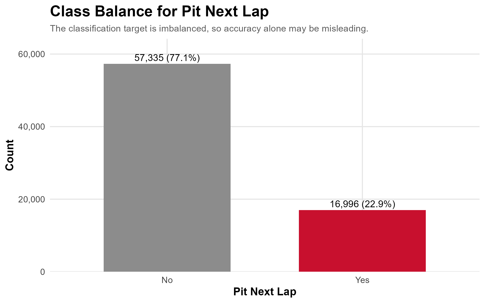
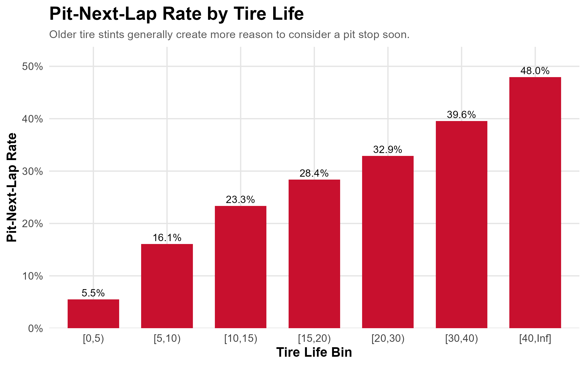

# Formula 1 Pit Stop Strategy and Lap Performance Analysis

## Professional Summary

This project is an end-to-end statistical learning analysis using Formula 1 lap-level strategy data. The goal was to compare regression and classification methods for two related problems: predicting lap time and predicting whether a driver will pit on the next lap.

The project was completed as a MATH 4230 capstone and is written as a methods atlas. It includes exploratory data analysis, model fitting, resampling, regularization, tree-based models, support vector machines, K-nearest neighbors, PCA, a neural network, and a final method comparison.

The main takeaway is that the best method depends on the goal. Lasso regression performed best for lap-time prediction, while boosting performed best for pit-next-lap classification. Simpler models like logistic regression and decision trees were still useful because they were easier to interpret.

## Final Report

The full final report is available here:

[View Final PDF Report](report/A_Methods_Atlas_of_Formula_1_Pit_Stop_Strategy_and_Lap_Performance.pdf)

## Project Highlights

- End-to-end statistical learning workflow
- Formula 1 lap-level strategy data
- Season-based train-test split
- Regression and classification modeling
- Model comparison across many methods
- Lasso was best for lap-time prediction
- Boosting was best for pit-next-lap prediction
- Honest discussion of missing race-context variables

## Featured Visuals

### Pit-Next-Lap Class Balance

This visual shows the imbalance in the classification target, where most laps are not followed by a pit stop.



### Pit-Next-Lap Rate by Tire Life

This plot shows how the observed pit-next-lap rate changes as tire life increases.



### Ridge and Lasso Test RMSE Comparison

This visual compares regularized regression models on the 2025 test set, with lasso producing the best lap-time prediction result.


### Classification Ensemble Performance

This visual compares ensemble classification models, where boosting produced the strongest AUC for pit-next-lap prediction.


## Main Results

| Task                    | Best Model       | Main Metric |  Result |
| ----------------------- | ---------------- | ----------: | ------: |
| Lap-time prediction     | Lasso regression |   Test RMSE | 10.4757 |
| Pit-next-lap prediction | Boosting         |    Test AUC |  0.8608 |

## Research Questions

This project focuses on two main modeling questions.

1. **Regression task:** Can lap-level predictors explain or predict `lap_time_s`?
2. **Classification task:** Can lap-level predictors predict `pit_next_lap`?

The regression task uses `lap_time_s` as the continuous response. The classification task uses `pit_next_lap` as the binary response.

## Dataset

- **Dataset:** F1 Strategy Dataset: Pit Stop Prediction
- **Source:** Kaggle
- **Author:** Aadi Gupta
- **Link:** https://www.kaggle.com/datasets/aadigupta1601/f1-strategy-dataset-pit-stop-prediction/data
- **Date accessed:** May 17, 2026

The raw data is not included in this repository because of GitHub file-size and upload limits. To reproduce the project, download the dataset from Kaggle and place the raw files in a local `data/raw/` folder before running the scripts.

## Methods Used

- Exploratory data analysis
- Simple linear regression
- Multiple linear regression
- Logistic regression
- Cross-validation
- Bootstrap
- Ridge regression
- Lasso regression
- Decision trees
- Bagging
- Random forest
- Boosting
- Support vector machines
- K-nearest neighbors
- Principal components analysis
- Neural network

## Repository Structure

```text
.
├── README.md
├── figures/
│   ├── ch02_eda/
│   ├── ch03_slr/
│   ├── ch04_mlr/
│   ├── ch05_logistic/
│   ├── ch06_resampling/
│   ├── ch07_regularization/
│   ├── ch08_decision_trees/
│   ├── ch09_tree_ensembles/
│   ├── ch10_svm/
│   ├── ch11_knn/
│   ├── ch12_pca/
│   └── ch13_neural_network/
├── report/
│   └── A_Methods_Atlas_of_Formula_1_Pit_Stop_Strategy_and_Lap_Performance.pdf
├── results/
│   ├── method_comparison.csv
│   ├── method_recommendations.csv
│   └── summary_statistics.csv
└── scripts/
    ├── 00_setup.R
    ├── 01_clean_data.R.R
    ├── 02_split_data.R
    ├── 03_dataset_profile_eda.R
    ├── 04_slr_lap_time.R
    ├── 05_mlr_lap_time.R
    ├── 06_logistic_pit_next_lap.R
    ├── 07_resampling_cv_bootstrap.R
    ├── 08_regularization_ridge_lasso.R
    ├── 09_decision_trees.R
    ├── 10_tree_ensembles.R
    ├── 11_svm.R
    ├── 12_knn.R
    ├── 13_pca.R
    ├── 14_neural_network.R
    ├── 15_method_comparison.R
    ├── main.tex
    └── references.bib
```

## How to Reproduce

1. Clone the repository.

```bash
git clone https://github.com/amuro4/f1-pit-stop-strategy-analysis.git
cd f1-pit-stop-strategy-analysis
```

2. Download the dataset from Kaggle.

```text
https://www.kaggle.com/datasets/aadigupta1601/f1-strategy-dataset-pit-stop-prediction/data
```

3. Place the raw dataset files in a local folder named:

```text
data/raw/
```

4. Open the project in RStudio.

5. Run the scripts in order.

```r
source("scripts/00_setup.R")
source("scripts/01_clean_data.R.R")
source("scripts/02_split_data.R")
source("scripts/03_dataset_profile_eda.R")
source("scripts/04_slr_lap_time.R")
source("scripts/05_mlr_lap_time.R")
source("scripts/06_logistic_pit_next_lap.R")
source("scripts/07_resampling_cv_bootstrap.R")
source("scripts/08_regularization_ridge_lasso.R")
source("scripts/09_decision_trees.R")
source("scripts/10_tree_ensembles.R")
source("scripts/11_svm.R")
source("scripts/12_knn.R")
source("scripts/13_pca.R")
source("scripts/14_neural_network.R")
source("scripts/15_method_comparison.R")
```

6. Compile the LaTeX report.

```text
scripts/main.tex
scripts/references.bib
```

The compiled final PDF is available in the `report/` folder.

## R Packages Used

The project uses R and the following main packages:

```text
tidyverse
janitor
lubridate
skimr
broom
ggplot2
corrplot
car
leaps
glmnet
tree
rpart
rpart.plot
randomForest
gbm
e1071
class
nnet
pROC
```

## Key Takeaway

The best model depends on the goal.

For prediction, lasso regression and boosting were the strongest methods in this project. Lasso had the best test RMSE for lap-time prediction, and boosting had the best AUC for pit-next-lap prediction.

For interpretation, logistic regression and decision trees were still valuable. Logistic regression gave interpretable probability-based results, while decision trees gave clear rule-based splits. This matters because a model that is easy to explain can be more useful than a black-box model in some reporting and decision-making settings.

## Limitations

This project should be viewed as a comparison of statistical learning methods, not as a complete Formula 1 pit-wall strategy system.

The dataset does not include several important race-status and circuit-condition variables, including:

- Safety Car
- Virtual Safety Car
- Yellow flags
- Red flags
- Track temperature
- Air temperature
- Circuit length
- Tire availability
- Pit lane time loss
- Team strategy context

Because these variables are missing, some pit-stop decisions may look unexpected in the data even if they made sense in the actual race context.

## Future Improvements

Future versions of this project could improve the analysis by adding:

- Race-status variables
- Circuit-level features
- Weather and temperature data
- Pit lane time loss by circuit
- Tuned pit-stop classification thresholds
- An interactive dashboard or app

## Author

**Adrian Muro**  
B.S. Mathematics, Statistical Data Science  
California State University, Bakersfield  
MATH 4230: Applied Statistical Methods for Data Science  
Spring 2026
